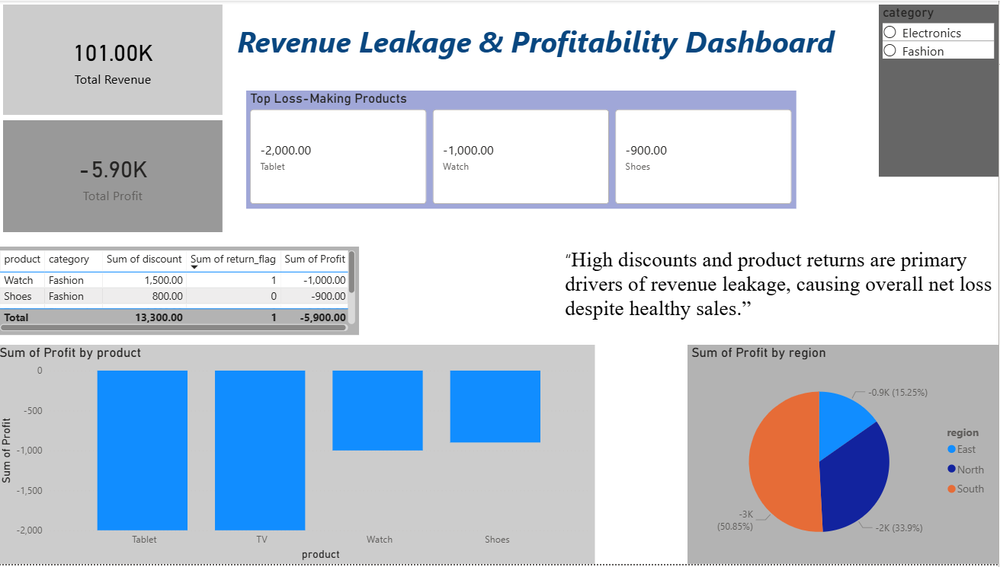

# Revenue Leakage & Profitability Analysis

## 📌 Problem Statement
Despite healthy sales revenue, businesses often suffer losses due to high discounts, returns, and cost inefficiencies. This project identifies revenue leakage sources and highlights loss-making products and regions.

## 🛠️ Tech Stack
- MySQL
- Python (Pandas, Matplotlib)
- Power BI

## 📊 Dataset
Retail sales data containing product, pricing, cost, discount, returns, quantity, region, and order date.

## 🔍 Analysis Performed
- Total Revenue vs Total Profit
- Profit by Product
- Profit by Region
- Impact of Discounts and Returns

## 📈 Dashboard

## 💡 Key Insights
- High discounts significantly reduce profitability.
- Product returns are a major cause of revenue leakage.
- Certain products consistently generate losses.
- Regional performance varies significantly.

## 🚀 Outcome
An interactive Power BI dashboard that helps identify and reduce revenue leakage through data-driven decisions.
